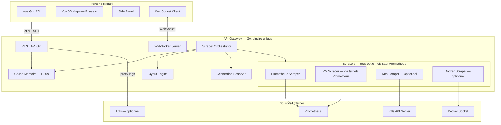
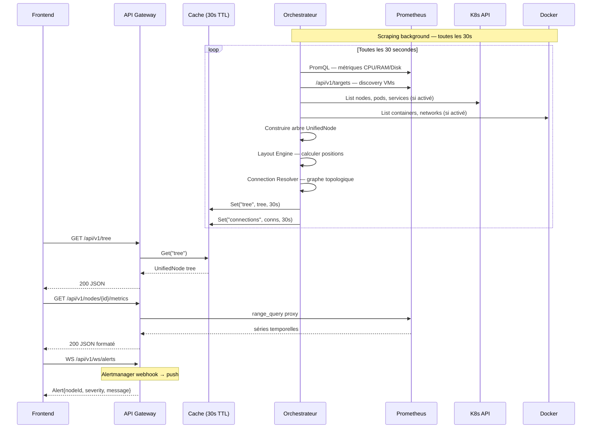
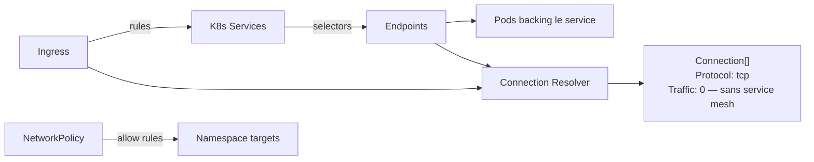

# Architecture — InfraMaps

## Contexte & Objectif

InfraMaps résout un problème précis : **visualiser l'état global d'une infrastructure mixte en moins de 3 secondes**, sans lire de chiffres. L'outil s'appuie exclusivement sur l'infrastructure d'observabilité déjà en place chez le client — aucun agent supplémentaire.

Le concurrent direct (Weave Scope) a été discontinué en 2024 suite à la fermeture de Weaveworks. L'espace est libre.

---

## Vue d'ensemble des composants



---

## Matrice de Capacités Multi-Source

> C'est la décision architecturale centrale. Prometheus est la seule source obligatoire.

| Source | Obligatoire | Fournit | Absent → comportement |
|--------|-------------|---------|----------------------|
| **Prometheus** | ✅ Oui | CPU, RAM, Disk pour tout host scraped (VMs, K8s nodes, containers via cAdvisor) | InfraMaps ne démarre pas |
| **K8s API** | ❌ Non | Topologie cluster/node/pod/service/namespace + connexions (Services+Endpoints) | Aucune vue K8s. Masqué dans l'UI. |
| **Docker socket** | ❌ Non | Containers standalone + réseaux Docker Compose + connexions réseau Docker | Aucune vue containers Docker. Masqué. |
| **Loki** | ❌ Non | Logs par pod/container (proxy en lecture seule) | Onglet logs masqué dans le Side Panel |

### Modes de déploiement supportés

| Mode | Sources actives | Cas d'usage |
|------|----------------|-------------|
| **Full stack** | Prometheus + K8s + Docker + Loki | Cluster K8s avec observabilité complète |
| **K8s only** | Prometheus + K8s | Cluster K8s sans containers standalone |
| **Docker only** | Prometheus + Docker | Serveurs Docker Compose, pas de K8s |
| **VM only** | Prometheus seul | Serveurs bare metal avec node_exporter uniquement |
| **Hybride** | Prometheus + K8s + Docker | Infra mixte (prod K8s + staging Docker) |

---

## Flux de Données



---

## Discovery des Sources

### VMs via Prometheus Targets (sans K8s)

La Prometheus API `/api/v1/targets` liste tous les hosts scrapés. Les targets avec `job="node"` correspondent aux hosts avec `node_exporter`. Leurs labels Prometheus (`environment`, `datacenter`, `team`) permettent de les grouper en îlots.

```
Prometheus /api/v1/targets
  → filter: job="node"
  → chaque active target = 1 UnifiedNode{Type: NodeTypeVM}
  → label "datacenter" → grouper dans un VMIsland
  → métriques: node_cpu_seconds_total, node_memory_*, node_filesystem_*
```

### Docker Compose via Docker Networks

```
Docker API → NetworkList
  → filter: com.docker.compose.project label
  → chaque projet = 1 groupe (type DockerComposeGroup)
  → containers dans le réseau = enfants
  → label com.docker.compose.service = nom du service
```

---

## Découverte des Connexions Réseau

**Problème :** InfraMaps doit afficher des connexions réseau sans service mesh (Istio/Linkerd).

**Solution :** Topologie logique depuis l'API K8s (ce qui PEUT se connecter) plutôt que trafic réel (ce qui SE connecte). C'est honnête et KISS.



**Niveaux de précision selon les sources :**

| Niveau | Source | Ce qu'on obtient |
|--------|--------|-----------------|
| 1 — Logique K8s | Services + Endpoints | Quels pods backing quel service |
| 2 — Entrées | Ingress rules | Quels services exposés vers l'extérieur |
| 3 — Politique | NetworkPolicy | Quelles connexions autorisées entre namespaces |
| 4 — Docker | Docker Networks | Quels containers partagent un réseau |
| Bonus — Istio | Prometheus `istio_requests_total` | Traffic réel (latency, RPS, errors) |

**Valeurs par défaut sans service mesh :** `Traffic: 0`, `Latency: 0`, `Errors: 0`. Ces champs sont seulement enrichis si Istio est détecté.

---

## Algorithme de Layout

> Décision complète dans `docs/adr/ADR-003-layout-algorithm.md`.

### Grid 2D — Algorithme déterministe

Les positions sont calculées **une seule fois par cycle de scraping** et mises en cache. Elles ne changent pas tant que la topologie ne change pas.

```
Pour chaque nœud parent (cluster, vm-island, node):
  1. Trier les enfants par ID (tri stable = ordre déterministe)
  2. Calculer cols = ceil(sqrt(len(children)))
  3. Position[i] = {
       X = parentX + (i % cols) * (nodeWidth + padding),
       Y = parentY + (i / cols) * (nodeHeight + padding)
     }
  4. Appliquer récursivement pour les sous-nœuds
```

**Garantie d'idempotence :** même topologie d'entrée → mêmes positions en sortie. Testé unitairement.

### 3D Maps — Hash déterministe (Phase 4)

```
Y = level * 150  (root=0, cluster=150, node=300, pod=450)
X = FNV32(nodeID) % parentWidth + parentOffsetX
Z = (FNV32(nodeID) >> 16) % parentDepth + parentOffsetZ
```

---

## Sécurité

| Surface | Approche | Niveau |
|---------|---------|--------|
| **Accès K8s** | ServiceAccount en lecture seule (RBAC strict) | Prod |
| **Accès Docker** | Socket monté en read-only `:ro` | Prod |
| **Accès Prometheus** | URL configurable, pas d'auth requise par défaut | MVP |
| **Accès Loki** | Proxy en lecture seule, 100 lignes max par requête | MVP |
| **Auth UI** | Désactivée en dev. K8s SA token en prod (phase 3) | Phases |
| **Actions** | **Hors scope** — pas de write access en production | Permanent |

---

## Limites Connues

| Limite | Impact | Mitigation |
|--------|--------|-----------|
| Trafic réseau réel sans service mesh | `Traffic`, `Latency`, `Errors` = 0 | Enrichi automatiquement si Istio détecté |
| Topology VMs sans service discovery | Pas de liens logiques entre VMs | Acceptable — les VMs sont des îlots indépendants |
| Large clusters (>500 pods) | Layout peut être dense | Pagination Phase 3 + lazy loading |
| Cache en mémoire | Redémarrage = 30s sans données | Acceptable — Prometheus est toujours disponible |
| Actions production | Non supportées | Décision permanente (sécurité) |

---

## Décisions Architecturales

→ Voir `docs/adr/` pour le détail et les alternatives considérées.

- **ADR-001** — Architecture multi-source optionnelle (Prometheus seul obligatoire)
- **ADR-002** — Pas de base de données (cache TTL en mémoire)
- **ADR-003** — Layout déterministe (grid indexé, pas de force-directed)
